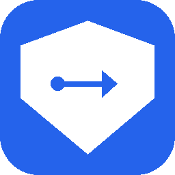
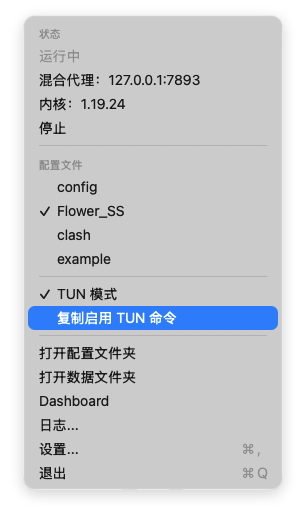

<div align="center">



# ProxyHelper

**macOS 菜单栏应用，一键控制 mihomo 内核与系统代理。**

[](https://github.com/roy2100/proxy-helper/actions/workflows/ci.yml)

</div>

<p align="center">
  
</p>

## 功能

- 一键启动/停止 mihomo 内核
- 自动设置/清除 macOS 系统代理（HTTP + SOCKS）
- 扫描指定文件夹下所有 `.yaml` / `.yml` 配置文件，支持快速切换
- 启动前依次检测配置中声明的端口（`external-controller` / `mixed-port` 或 `port` + `socks-port`），占用即报错不启动
- 内核崩溃后自动重启（最多 3 次）
- 纯菜单栏 app，不占 Dock

## 依赖

- macOS 26 Tahoe 或更高
- [mihomo](https://github.com/MetaCubeX/mihomo)：`brew install mihomo`

## 安装

从 [Releases](../../releases) 下载最新的 `ProxyHelper-vX.X.X.zip`，解压后将 `ProxyHelper.app` 拖入 `/Applications`。

### Gatekeeper 拦截处理

由于安装包未经 Apple 公证，首次打开时 macOS 会提示"无法打开，因为 Apple 无法检查其是否包含恶意软件"。

**方法一：在 Finder 中右键打开（推荐）**

1. 在 Finder 中找到 `ProxyHelper.app`
2. 按住 `Control` 键单击（或右键）→ **打开**
3. 弹窗中点击 **打开** 确认

此后即可正常双击启动，无需重复操作。

**方法二：命令行移除隔离标记**

```bash
xattr -dr com.apple.quarantine /Applications/ProxyHelper.app
```

**从源码构建**

1. 克隆仓库，用 Xcode 打开 `ProxyHelper.xcodeproj`
2. Signing & Capabilities → 设置你的 Development Team
3. `⌘R` 运行

## 使用

1. 点击菜单栏图标 → **设置...**
2. 选择 mihomo 配置文件夹（存放 `.yaml` 文件的目录）
3. 回到菜单，选择配置文件 → **启动**

ProxyHelper 会从当前配置文件读取 `mixed-port`、`port`、`socks-port` 来设置系统代理；缺失时回退到 `7890 / 7891`。

## TUN 模式

菜单栏勾选「TUN 模式」可启用全局 TUN，使所有应用（包括不遵守系统代理设置的 CLI 工具）走代理。开关通过 mihomo `PATCH /configs` 在运行时注入 `tun.enable`，不会改动你的 yaml 文件；TUN 的其它参数（`stack`、`auto-route` 等）由配置文件自身的 `tun:` 段决定。

由于 macOS 上创建 utun 接口需要 root 权限，首次使用前请执行一次：

```bash
./scripts/enable-tun.sh
```

该脚本会给 mihomo 二进制设 setuid 位，之后启动 mihomo 自动以 root 运行。

注意事项：

- `brew upgrade mihomo` 后 setuid 位会被覆盖，需重新执行脚本。
- 设了 setuid 位意味着本机任何用户都能以 root 身份执行 mihomo，单用户开发机场景下可接受；多人共享机器请勿这么做。

## 说明

- 不打包 mihomo 内核，需用户自行安装
- 不上 App Store，关闭沙盒
